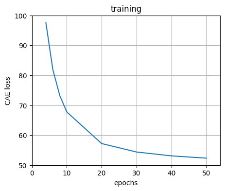

# Contractive Autoencoder (CAE)

Pytorch implementation of CAE on MNIST dataset.

To run the entire process for CPE727 class type the following in your terminal: **bash run-me.sh**

## Results:

## Requirements:

- PyTorch
- Python 3.6
- matplotlib
