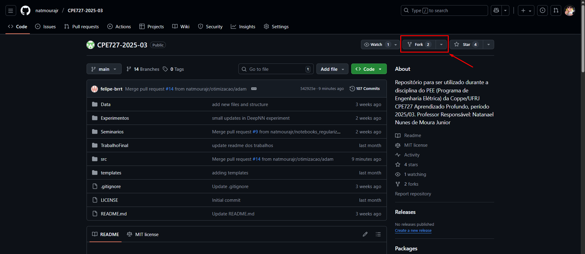

O objetivo é interegir com um repositório alheio de forma que outras pessoas do repositório original vejam as tuas alterações. O fluxo será:

<code>fork → clone → branch → push → pull request</code>

### 1) Fluxo recomendado (GitHub) — fork + PR

Esse é o jeito padrão quando você não tem permissão de escrita no repo original.

### Passos rápidos (web + terminal):

No GitHub, vá ao repositório original (https://github.com/natmourajr/CPE727-2025-03) e clique em Fork (canto superior direito).



-> Isso cria uma cópia do repo na sua conta (github.com/SEU_USUARIO/CPE727-2025-03).


### Clone o fork para sua máquina:

```sh
git clone https://github.com/SEU_USUARIO/CPE727-2025-03.git
cd CPE727-2025-03
```

Configure o remoto upstream apontando para o repo origina, pois será útil para sincronizar depois:

```sh
git remote add upstream https://github.com/natmourajr/CPE727-2025-03.git
git fetch upstream
```

Crie uma branch nova para sua alteração:

```sh
git checkout -b feature/sua_feature
git add .
git commit -m "Descrição curta do que foi alterado"
```

Envie sua branch para o fork no GitHub:

```sh
git push origin feature/sua_feature
```

No GitHub, entre no seu fork e verá um botão sugerindo abrir um `Pull Request` do feature/sua_feature do seu fork para o repositório original. Escreva um título claro e descrição, pois facilita a revisão, em seguida escolha a branch alvo do repo original (normalmente main ou develop). Os mantenedores do repositório original receberão a PR, revisarão e poderão aceitar (merge) — aí suas alterações aparecerão no repo original.

### 2) Se você já clonou o repo original sem ter feito fork

Se você clonou https://github.com/natmourajr/CPE727-2025-03.git diretamente e tem alterações locais, faça assim:

# dentro da pasta clonada
git remote rename origin upstream        # opcional, renomeia o origin para upstream
git remote add origin https://github.com/SEU_USUARIO/CPE727-2025-03.git
# agora origin = seu fork, upstream = repo original
git checkout -b feat/minha-melhora
git add .
git commit -m "minha mudança"
git push origin feat/minha-melhora
# abrir PR no GitHub do seu fork -> upstream

### 3) Alternativa: pedir permissão para ser colaborador

Se você precisa push direto no repositório original (sem PR), peça ao dono que te adicione como collaborator (Settings → Manage access) ou te dê permissão em uma branch. Só então você poderá:

git push upstream feat/minha-melhora

### 4) Mantendo seu fork atualizado (importante)

Antes de trabalhar, mantenha seu fork sincronizado com o original:

git fetch upstream
git checkout main
git merge upstream/main   # ou: git rebase upstream/main
git push origin main


Quando sua branch divergir, rebase/merge da main atualizada evita conflitos.

### 5) Outras opções rápidas

Enviar um patch/PR via GitHub web: se for só um arquivo novo, dá pra editar direto no GitHub (botão ✏️) e abrir PR.

Criar um repositório novo: se quiser compartilhar sem PR, crie um repo seu e poste o link.

Enviar arquivos por e-mail / drive: menos ideal — preferível PR.

### 6) Dicas de boas práticas para PRs

Use uma branch por feature/fix.

Título claro + descrição (o que, por que, como testar).

Inclua instruções para reproduzir/testar.

Se houver testes, rode-os antes de enviar.

Quer que eu gere os comandos personalizados com teu nome de usuário do GitHub (eu já tenho a URL original que você postou) — ou prefere que eu te guie por tela (Windows / Linux)?